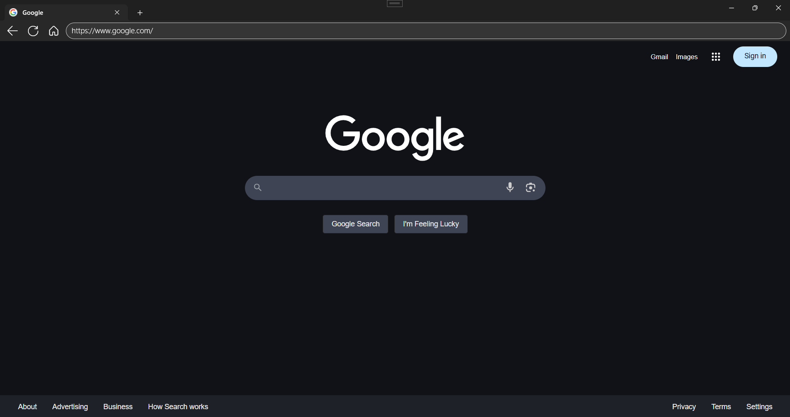

# WinUI3 Browser

A modern web browser built with WinUI 3 and Microsoft Edge WebView2, offering a clean and intuitive user interface with essential browsing features.

## Screenshots

## Features Needed for Contribution

- **Profile Management** (In Progress)
  - [ ] Multiple user profiles support
  - [ ] Profile synchronization
  - [ ] Custom profile settings

- **Window Management** (In Progress)
  - [ ] Window dragging functionality
  - [ ] Multiple window support
  
- **Settings & Customization** (In Progress)
  - [ ] Homepage customization
  - [ ] Browser settings panel
  - [ ] Download preferences
  - [ ] Privacy settings

- **Bookmark Management** (Planned)
  - [ ] Bookmark bar implementation

- **Extension Support** (Planned)
  - [ ] Extension manager UI
  - [ ] Extension installation system

- **Privacy Features** (Planned)
  - [ ] Private browsing mode
  - [ ] Clear browsing data functionality
  - [ ] History management system
  - [ ] Download manager

- **Help & Support** (Planned)
  - [ ] About page
  - [ ] Help documentation
  - [ ] Version information display

## Technical Details

- **Framework**: .Net 8, WinUI 3
- **Language**: C# 13.0
- **Target Platform**: Windows 10/11

## NuGet Packages

- Microsoft.WindowsAppSDK
- Microsoft.Windows.SDK.BuildTools
- Microsoft.UI.Xaml
- WebView2

## Contributing

We welcome contributions to improve the WinUI3 Browser! Here's how you can help:

1. Fork the repository
2. Create a new branch for your feature
3. Make your changes
4. Submit a pull request

### Development Guidelines

- Follow C# coding conventions
- Write clear commit messages

## License

This project is licensed under the MIT License.
